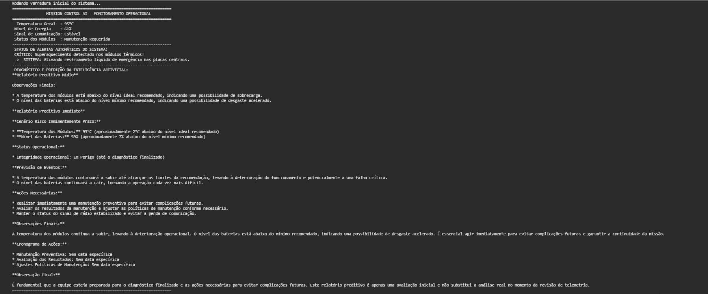
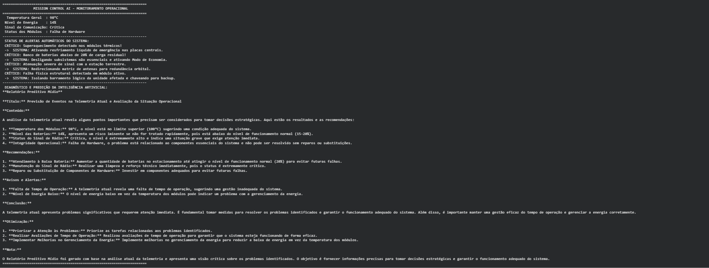

# Global Solution GS2026.1: Prompt and Artificial Intelligence

## Mission Control AI — Sistema Inteligente de Telemetria Espacial
 
**Turma:** Ciência da Computação

### Integrantes:
- Nickollas Korner — RM: 569655
- Pierre Biason — RM: 569718
- Lucas Santana — RM: 573197

---

## Descrição do Projeto
Este projeto consiste em um sistema em Python voltado ao monitoramento operacional e análise preditiva de uma missão espacial experimental. A aplicação simula o recebimento contínuo de dados críticos de telemetria (Temperatura dos Módulos, Níveis de Energia das Baterias, Status de Sinal de Comunicação e Integridade de Hardware), executando tomadas de decisão lógicas em tempo real por meio de alertas nativos e correções automatizadas. 

O diferencial da plataforma está na sua integração com o modelo de linguagem **Llama 3.2 (1B)** de forma 100% local e sem chaves de API através do ecossistema **Ollama**. A IA atua interpretando o contexto geral da telemetria, emitindo diagnósticos analíticos em linguagem natural e prevendo falhas operacionais complexas antes que elas inviabilizem a integridade do ambiente espacial.

---

## Demonstração
As imagens abaixo mostram a execução prática do sistema simulado no ambiente de desenvolvimento:

### 1. Telemetria em Parâmetros Normais (Rotina)

### 2. Painel de Intercepção em Cenário Crítico Geral

*Nota: Os prints reais da aplicação rodando foram salvos no diretório raiz na pasta `assets/` conforme os requisitos estruturais estabelecidos.*

---

## Tecnologias Utilizadas
* **Python 3.x:** Linguagem base de construção de toda a arquitetura e lógica condicional.
* **Ollama API:** Gerenciamento, execução em segundo plano e orquestração do modelo local.
* **Llama 3.2 (1B):** Modelo de linguagem generativa de código aberto utilizado para análise contextualizada e predição.
* **Google Colab:** Ambiente em nuvem para execução organizada do notebook.

---

## Como Executar o Projeto
O projeto foi inteiramente adaptado para rodar na nuvem sem a necessidade de nenhuma instalação prévia local na máquina hospedeira.

1. Acesse o ambiente do projeto diretamente pelo link público:
   [Acessar Notebook no Google Colab](https://colab.research.google.com/drive/1NWFvoOqKprJVbO_ivCQIq9586rhYZbO7?usp=sharing)
2. Certifique-se de estar conectado a uma instância ativa de computação no menu superior do Colab.
3. Execute todas as células em ordem sequencial (Etapa 1, Etapa 2 e Etapa 3).
4. O download do modelo, a inicialização do microsserviço Ollama em background e as bibliotecas adicionais serão configuradas e carregadas de forma 100% automatizada no primeiro bloco.

---

## Vídeo de Demonstração
A apresentação em vídeo contendo a introdução de todos os membros do time e a validação do sistema operando com a geração de textos da IA em tempo real pode ser visualizada no link abaixo:

https://youtu.be/VMu8N9PiyAU
